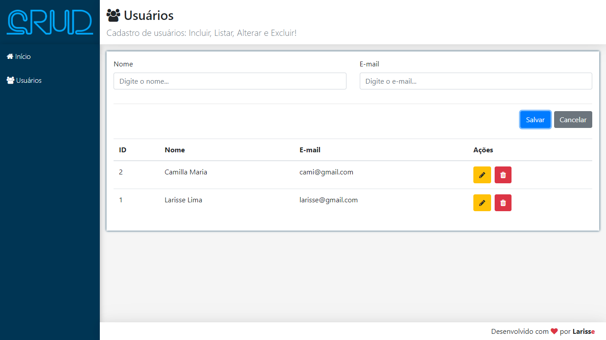

<div align="center">
  
</div>

<h3 align="center"> CRUD EM REACT


<h1 align="center">
    
</h1>


# :pushpin: Lista de Conteúdo 
* [Sobre](#recycle-sobre)
* [Tecnologias Utilizadas](#clipboard-tecnologias-utilizadas)
* [Instalação e Execução](#desktop_computer-instalação-e-execução)
* [Licença](#scroll-licença)


# :recycle: Sobre
Sistema criado para um Crud em React. Consiste em tela principal e de cadastro de cliente, com nome completo e Email. Onde após o cadastro feito,é possível visualizar uma lista de contatos cadastrados em tela,por tabela. Na tela é possível editar,excluir, adicionar mais produtos e listá-los.

# :clipboard: Tecnologias Utilizadas
* [Yarn](https://yarnpkg.com/)
* [NodeJs](https://nodejs.org/en/)
* [ReactJs](https://reactjs.org/)
* [Bootstrap](https://getbootstrap.com/)
* [JSX](https://pt-br.reactjs.org/docs/introducing-jsx.html)


# :desktop_computer: Instalação e Execução
**Antes de iniciar, é necessário ter o [NodeJs](https://nodejs.org/en/) e o [Yarn](https://yarnpkg.com/) baixado na máquina.

## Comando para clonar o repositório: 
```bash
  #Para clonar o projeto
  git clone https://github.com/LarisseLima/react-crud
```
## Para rodar a parte do servidor:
```bash
  #Navegar e baixar as depêndencias
  cd backend
  yarn install

  #Iniciar o servidor com yarn
  yarn start
```

## Para rodar a aplicação na parte do cliente web:
```bash
  #Navegar e baixar as depêndencias web
  cd frontend
  yarn install
  
  #Iniciar a aplicação
  yarn start
```
Vá para http://localhost:3001 para ver o website.


# :scroll: Licença
Este projeto está sob a [LICENÇA](https://opensource.org/licenses/MIT) do MIT


<p align="center"><b>Feito com 	:coffee: por Larisse Lima</b></p>
